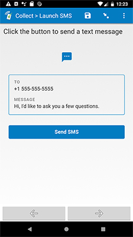

# Launch SMS

## Description

This plug-in will launch and populate the default SMS app on your device. It receives a phone number and a message as parameters, and provides a button to launch your SMS app (pre-filling the number and message from the parameters). The user must tap on the "send" button in the SMS app to send the message.

### Data format

This field plug-in requires the `text` field type.

A record of the attempts to launch the SMS app are stored as the field's response in the following format:

* If the SMS app was successfully launched*, the response will be:
  > SMS created. Recipient: `number`. Message: "`message`".
* If there was an error, the response will be:
  > There was an error creating the SMS: `error`

Please note:

* A "success" message on Android does not mean an SMS was sent. This means only that the field plug-in successfully launched and populated the SMS app.
* If you're using this field plug-in on iOS or web forms, then simply clicking the *Send SMS* button is considered a success (error callback is Android-only).

## How to use

### Getting started

1. Download the test form [extras/test-form](https://github.com/surveycto/launch-sms/raw/master/extras/test-form/Launch%20SMS.xlsx) from this repo and upload it to your SurveyCTO server.
1. Download the [launch-sms.fieldplugin.zip](https://github.com/surveycto/launch-sms/raw/master/launch-sms.fieldplugin.zip) file from this repo, and attach it to the test form on your SurveyCTO server.
1. Make sure to provide the correct parameters (see below).

### Parameters

| Key | Value |
| --- | --- |
| `number` | The phone number to which the SMS should be sent. |
| `message` | The body of the text message. |
| `button_label` (optional) | The label of the button. If no `button_label` parameter is specified, the button will be labeled "Send SMS". |

*Note: it is suggested to use values stored in other fields for the parameters. Take a look at the test form to see how this is accomplished.

## More resources

* **Test form**  
[extras/test-form](https://github.com/surveycto/launch-sms/raw/master/extras/test-form/Launch%20SMS.xlsx)
* **Developer documentation**  
Instructions and resources for developing your own field plug-ins.  
[https://github.com/surveycto/Field-plug-in-resources](https://github.com/surveycto/Field-plug-in-resources)
* **User documentation**  
How to get started using field plug-ins in your SurveyCTO form.  
[https://docs.surveycto.com/02-designing-forms/03-advanced-topics/06.using-field-plug-ins.html](https://docs.surveycto.com/02-designing-forms/03-advanced-topics/06.using-field-plug-ins.html)
